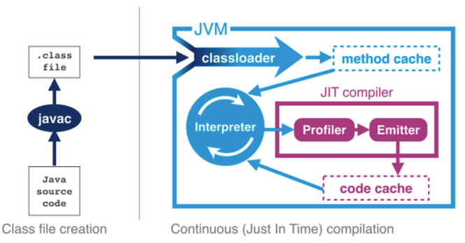

## Overview

* 'J' in JVM is misleading!
* 

## Class file structure

* Magic Number: 0xCAFEBABE (file cmd)
    
    > file World.class
    HelloWorld.class: compiled Java class data, version 52.0
    

## class file disassembler

    javac HelloWorld.java
    javap HelloWorld
    javap -c HelloWorld     # disassemble method 
    javap -v HelloWorld     # print stack size, locals and args

javac automatically add one no-arg default ctor.

## stack based virtual machine

* not the same as phyciscal machines which has registers
The action of the JVM interpreter can be simply thought of a switch inside a while loop - processing each opcode independently of the last using the stack positions to hold intermediate values.

ituation for real production-grade Java interpreters is a little more complexo

To achieve this, the operating system starts the virtual machine process and almost immediately, the first in a chain of class loaders is initialised. This initial loader is known as the Bootstrap classloader, and contains classes in the core Java runtime. In current versions these are loaded from rt.jar, although this is changing in Java 9

The Extension classloader is created next, it defines its parent to be the Bootstrap classloader, and will delegate to parent if needed. Extensions are not widely used, but can supply overrides and native code for specific operating systems and platforms. Notably, the Nashorn Javascript runtime in Java 8 is loaded by the Extension loader.
Finally the Application classloader is created, which is responsible for load- ing in user classes from the defined classpath. 

The plication classloader is encountered extremely frequently, and it has the Exten- sion loader as its parent.

Java loads in dependencies on new classes when they are first encountered during the execution of the program. If a class loader fails to find a class the behaviour is usually to delegate the lookup to the parent. If the chain of look- ups reaches the bootstrap class loader and isn’t found a ClassNotFoundEx- ception will be thrown.

It is important that developers use a build process that
  e ectively compiles with the exact same classpath that will be used in Produc- tion, as this helps to mitigate this potential issue.
  

Under normal circumstances Java only loads a class once and a Class ob- ject is created to represent the class in the runtime environment. However, it is important to realise that the same class can potentially be loaded twice by dif- ferent classloaders. As a result class in the system is identified by the classload- er used to load it as well as the fully qualified classname (which includes the package name).

